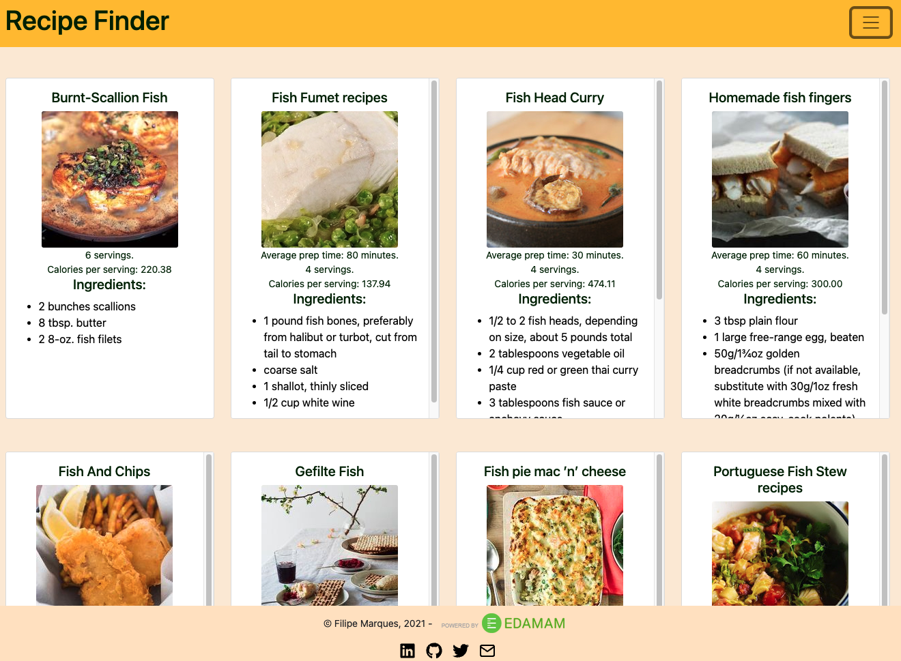
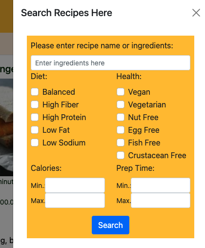
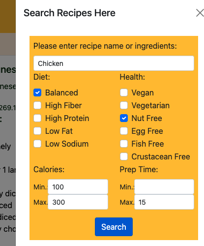
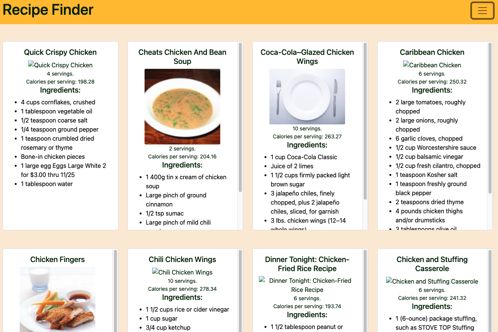
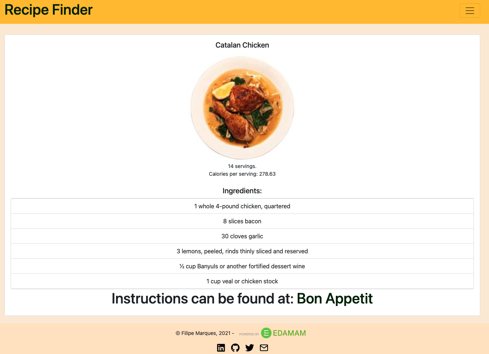

# Project 2 - Recipe Search

Second project on Software Engineer Immersive cohort at General Assembly.

## Project Goals

Display mastery on usage of API (Application Programming Interface) calls in order to display data to the user.

### Project Layout

> Live project can be found [here](https://fm-recipe-finder.herokuapp.com/).

When first visiting the website, the user is presented with a list of 20 random recipes.

By clicking on the hamburget menu, the user is presented with the following form

In the form above the user can enter a recipe name or ingredient name to be that will be fetched by the API call, and also select and specify other parameters for the search, like so:

> Obs: all fields, except "Recipe/Ingredient(s)", are optional.

In case of a successful response from the API, the user should be presented with a new list of recipes

> At the time of the documentation there were some difficulties with the API where it was not returning all the pictures

When the user clicks on one of the recipe cards of a successful API response, they are presented with a page with a list of all ingredient and a link they can click to follow the instructions of preparation.

In case the query parameters returns comes back empty, meaning no results were found, the user is presented with an alert message.

### User Stories

- [x] User should be presented with a list of recipes when webpage is loaded.
- [x] User should be able to search for recipes provided by the Edaman API.
- [x] Clicking on a recipe should bring user to `/recipe/:recipe` route where user is presented with instructions on how to cook said recipe.
  > The Edaman API does not offer the data of instructions. Instead points user to recipe source website.

### Road Map

- [ ] Have form appear on the side of large screens and toggled by a hamburger menu on medium and small screens.

### Technologies Used

- React
- Boostrap
- SASS
- React Router DOM
- React Icons
